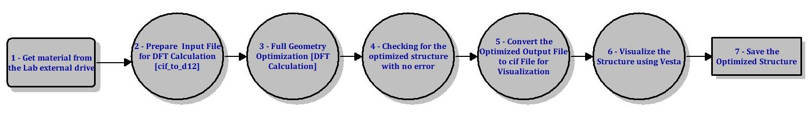

In general, **Data Flow Diagram (DFD)** is a graphical representation of how information flows through the system. DFD gives a better understanding of the system operation to identify possible problems, improve productivity, and develop better processes.

In the context of optimizing materials using **Density Functional Theory (DFT)**, the use of **DFT ([read futher](https://www.physics.udel.edu/~bnikolic/QTTG/NOTES/DFT/PRIMER_IN_DFT_SPRINGER_2003/NOGUEIRA=tutorial_on_density_functional_theory.pdf))** has become integral for predicting and optimizing materials at the quantum mechanical level. The DFD (see figure below) gives visual representation of the flow of information and process involved in the comutational model.  

Here is the detail explanation of each step in teh DFD process

1. The material used in the project was collected from the Lab achive. The material is already in cif format.

2. Here, the material format needs to be converted from cif file to the d12 file. A code is used to implement this conversion.

3. The material from the second step (d12 file) is needed here for the DFT calculations to optimize the structure parameters (on HPCC).

4. It is always important to check for errors in the optimized materials before continue with other stuff. A pythone code has been written here to separate errored from the successful ones.

5. The optimized output file from the previous step needs to be converted back to a cif file for visualization.

6. Visualization can be achieved by relevant software such as Vesta which is an external software

7. Save the optimized structures. This will be used for other calculations.
