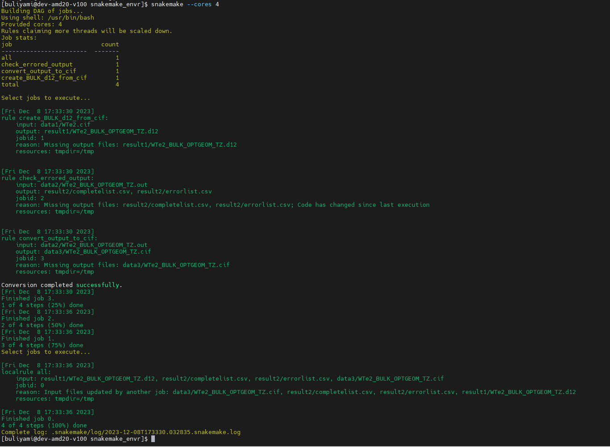
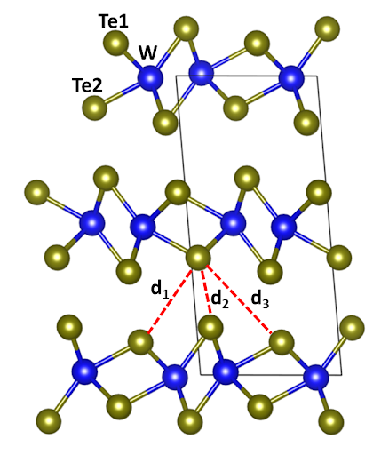

The workflow can generally be defined as the sequence of steps involved in moving from the begining to the end of the working process. The snakefile for this project can be found in the [workflow branch](https://github.com/ibuliyaminu/Computational_Workflow_Project_for_2D_Materials/blob/Workflow/snakemake_envr/Snakefile).

## Step 1: rule all

I have used a special rule **"rule all"** that tells the snakemake to excute all the rule in the snakefile.

## Step 2: rule create_BULK_d12_from_cif

This rule takes input file **WTe2.cif** from data1 and excute the rule using the [python script](https://github.com/ibuliyaminu/Computational_Workflow_Project_for_2D_Materials/blob/Workflow/snakemake_envr/scripts/create_BULK_d12_from_cif.py). The output file **WTe2_BULK_OPTGEOM_TZ.d12** is deployed to result1 as expected.

## Step 3: rule run_crystal17

This is the density functional calculation section where the output file from above rule is used for the calculation. The calculation was submitted using [submitcrystal17.sh](https://github.com/ibuliyaminu/Computational_Workflow_Project_for_2D_Materials/blob/Workflow/snakemake_envr/scripts/submitcrystal17.sh) and [submitcrystal17.py](https://github.com/ibuliyaminu/Computational_Workflow_Project_for_2D_Materials/blob/Workflow/snakemake_envr/scripts/submitcrystal17.py). This section was completed outside the snakefile and the result was copied to the workflow for continuation. This is due to the fact that the waiting time (about 5 days) required for the DFT calculation is too much for the snakemake. In the future, I will have to read more on how solve this kind of problem.

## Step 4: rule check_errored_output

This rule actually checks for errors in the calculation. It deploys the errored and un-errored results in the result2 folder. In the context of this project, there was no error in the calculation.Here is the [python script](https://github.com/ibuliyaminu/Computational_Workflow_Project_for_2D_Materials/blob/Workflow/snakemake_envr/scripts/updatelists.py) for checking the error.

## Step 5: rule convert_output_to_cif

This rule converts the output file to cif file for visualization. The output file is deploy to the data3 folder. Here is the [python script](https://github.com/ibuliyaminu/Computational_Workflow_Project_for_2D_Materials/blob/Workflow/snakemake_envr/scripts/CRYSTAL2cif.py) that was used for the excusion.

## Step 6: Visualization

This section requires an external software. So, in the context of this project, I have done this outside the snakemake and copy the result here.

## Step 7: Workflow Results

